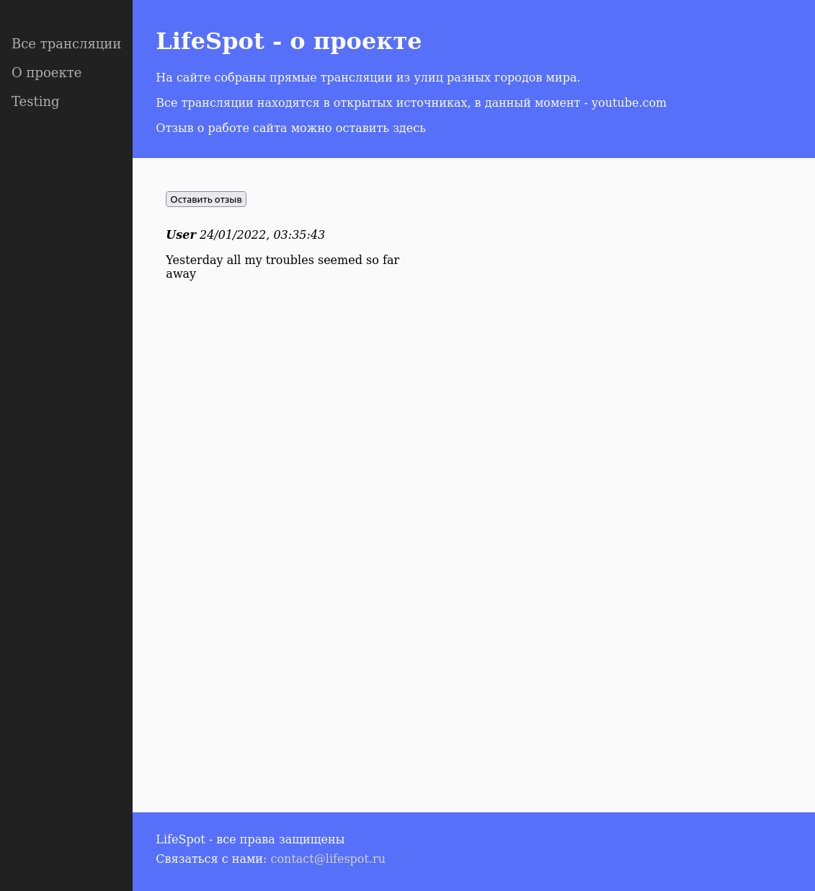

## 29. Практика

### Задание 29.7.4

В этом промежуточном задании мы не будем проверять ваши знания по JavaScript, а вместо этого проверим, как хорошо вы успели познакомиться со структурой проекта, и подготовим страницу для финального задания.

Вы наверняка заметили, что два раздела на нашем сайте дублируют друг друга.

У нас есть страница со всеми трансляциями и раздел «О проекте», который тоже ведет на страницу с трансляциями.

Сделайте отдельную страницу «О проекте», на которой тоже будет хедер, футер и боковое меню, а также небольшое произвольное описание (достаточно одного предложения).

Страница должна быть доступна по URL `localhost:5000/about`.

### Задание 29.7.5

Теперь самое интересное. Нужно будет дать пользователям возможность оставлять отзывы о нашем сайте.

Раздел с отзывами будет на странице «О проекте», которую вы только что создали.

#### Часть 1

Добавьте и подключите отдельный файл JavaScript для нашей новой страницы. Проверьте его работоспособность.

#### Часть 2

Добавьте кнопку «Оставить отзыв».

#### Часть 3

Напишите функцию, которая будет при нажатии на кнопку «Оставить отзыв» запрашивать у пользователя его имя, а затем текст комментария.

После этого нужно будет добавить на страницу сам комментарий, имя пользователя и дату (уже с помощью другой функции).

Пусть первая функция будет у вас иметь классическую запись, а вторая -- стрелочную!

## Скриншот

