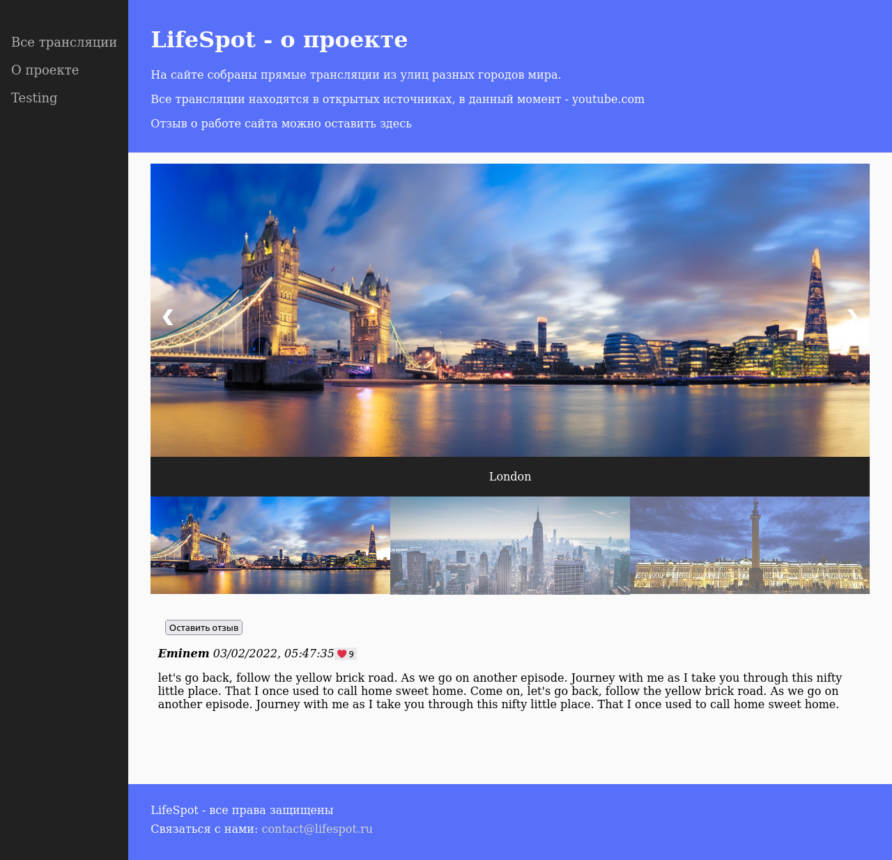

## 31 ПРАКТИКУМ

Ваше финальное задание будет состоять из нескольких этапов, включающих в себя самые разные темы из тех, что вы изучали в модулях этого блока: основы HTML, основы CSS и основы JavaScript.

Приступим!

На сайте в раздел «О проекте» необходимо добавить слайдер из фото-картинок.

Картинки можете использовать отсюда, или любые на свой вкус.

**Ваш слайдер не обязательно должен выглядеть так, но нужно соблюсти следующие условия:**

- слайды являются изображениями
- слайды можно «листать» с помощью кнопок навигации, либо непосредственно взаимодействуя с ними мышкой.

#### Часть 1. Готовим проект

Подготовьте проект: создайте отдельный _HTML_-шаблон слайдера, который будет вставляться в базовый шаблон страницы.

Подготовьте базовую страницу, на которой планируется использовать слайдер. Подумайте, как вставлять в неё _HTML_-код слайдера.

Сделайте так, чтобы шаблон слайдера у вас загружался на страницу, и проверьте это, вставив пока что вместо слайдера простой текст.

#### Часть 2. Изображения

Теперь можно заполнять шаблон содержимым.

Добавьте в шаблон блоки с картинками, которые у вас будут на слайдере. Пока пусть просто отображаются на странице без каких-либо эффектов.

С точки зрения веб-сервера, изображения ничем не отличаются от стилей и скриптов JavaScript (сервер точно так же отдает их клиенту в неизменном виде), поэтому не забудьте обновить `EndpointMapper.cs`, добавив отдельный метод для изображений, по аналогии с _CSS_ и _JS_.

#### Часть 3. Стили

Оформите ваши элементы с помощью _CSS_, чтобы страница приобрела законченный вид. Скрипты для переключения слайдов пока не добавляйте.

#### Часть 4. JavaScript

Добавьте _JavaScript_-код, чтобы слайды переключались (и неактивные картинки не были видны).

## Скриншот

