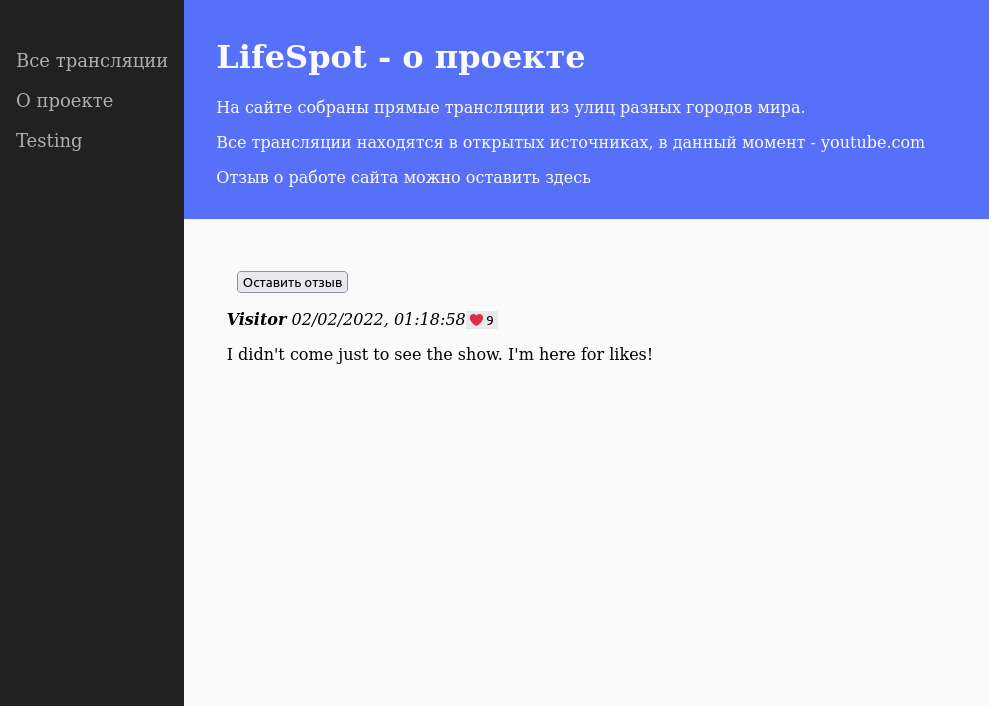

## 30. Практика

### Задание 30.1.11

Измените обработку сессии на странице index.js так, чтобы использовалась структура данных объект вместо Map.

### Задание 30.1.12

Давайте сделаем наш сайт немного умнее!

Ознакомьтесь с небольшим описанием здесь и измените наш код так, чтобы:

- Для хранения всех данных сессии (время начала, user-agent, возраст пользователя) использовался объект window.sessionStorage.
- Возраст у пользователя запрашивался только один раз, при первичном входе на страницу.
- Приветствие показывалось только один раз, при первичном входе на страницу.
- Если пользователь уже один раз прошел проверку возраста, он должен спокойно обновлять страницу и не видеть никаких всплывающих окон.
- Время начала сессии должно также проставляться только один раз, при первичном входе на страницу.

### Задание 30.2.4

У нас в проекте есть страница `about.html`, на которую можно добавлять комментарии.

Давайте расширим функционал этой страницы, добавив возможность оставлять отзывы (и у отзыва, в отличие от комментария, будет новое свойство — рейтинг).

Рейтинг отзыва отражает то, насколько он полезен для других пользователей.

Сделайте так, чтобы на страницу вдобавок к обычным комментариям (которые добавляются сейчас) можно было добавить отзыв, у которого есть рейтинг, по умолчанию равный 0.

Реализация должна быть следующая:

- Создаем объект, представляющий комментарий, со всеми свойствами, что уже есть сейчас.
- Запрашиваем у пользователя все данные как для обычного комментария (как и происходит сейчас).
- Затем спрашиваем с помощью конструкции confirm(), хочет ли пользователь, чтобы его комментарий могли оценить другие пользователи.
- Если да, то используем уже существующий комментарий в качестве прототипа и создаем из него новый объект — отзыв, который будет иметь дополнительное свойство — rate (т.е. рейтинг).
- Затем публикуем получившийся объект на странице (как уже реализовано сейчас). И ещё тут нужно будет проверить, действительно ли объект является отзывом. Если является — публикуем также и его рейтинг.

### Задание 30.3.6

Перепишите наш функционал по добавлению комментариев с использованием функции-конструктора и контекста `this`.

Пусть обычные комментарии у вас создаются через конструктор, а ту часть кода, которая превращает объект комментария в другой объект — отзыв с оценкой — оставьте без изменений.

### Задание 30.3.7

Ну и, наконец, самое приятное.

Все мы любим получать лайки, и сейчас мы добавим эту возможность нашим комментариям!

Добавьте кнопку с символом ❤️ напротив ваших отзывов, рядом с которой будет отображаться счетчик лайков! При нажатии на кнопку количество лайков у комментария должно увеличиваться на 1.

## Скриншот

