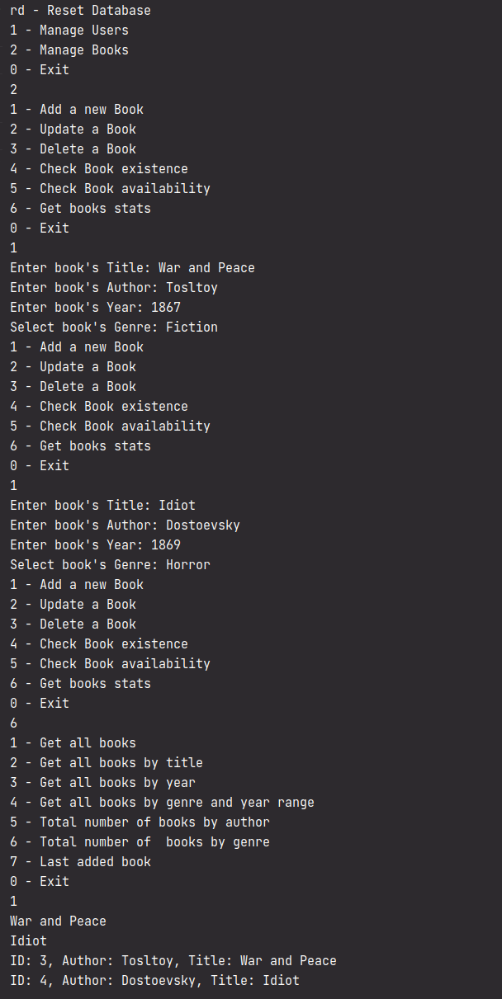

## Задание

# Проект

### Задание 25.2.4

Создайте проект с использованием _Entity Framework Core_ и реализуйте схему Базы данных с помощью классов. За тему данного проекта возьмите электронную библиотеку, в которой существуют пользователи и книги. У пользователя обязательно должны присутствовать поля `Имя` и `Email`, а у книги — `Название` и `Год выпуска`.

### Задание 25.3.5

Для каждой из моделей в приложении создайте собственный класс-репозиторий (например, _UserRepository_ и _BookRepository_), в которых опишите следующие действия: выбор объекта из БД по его идентификатору, выбор всех объектов, добавление объекта в БД и его удаление из БД. А также специфичные методы: обновление имени пользователя (по `Id`) и обновление года выпуска книги (по `Id`).

###Задание 25.4.3

Пришло время расширить проект и добавить в него некоторые новые части. Реализуйте с помощью одной из связей возможность получения книги «на руки» пользователем (для этого придется удалить таблицы из БД, либо воспользоваться `EnsureDeleted`). А также придумайте, как можно добавить в книгу автора и жанр книги.

### Задание 25.5.4

С помощью полученных знаний дополните репозитории методами, которые позволят совершать следующие действия:

1. Получать список книг определенного жанра и вышедших между определенными годами.
2. Получать количество книг определенного автора в библиотеке.
3. Получать количество книг определенного жанра в библиотеке.
4. Получать булевый флаг о том, есть ли книга определенного автора и с определенным названием в библиотеке.
5. Получать булевый флаг о том, есть ли определенная книга на руках у пользователя.
6. Получать количество книг на руках у пользователя.
7. Получение последней вышедшей книги.
8. Получение списка всех книг, отсортированного в алфавитном порядке по названию.
9. Получение списка всех книг, отсортированного в порядке убывания года их выхода.

## Скриншот

