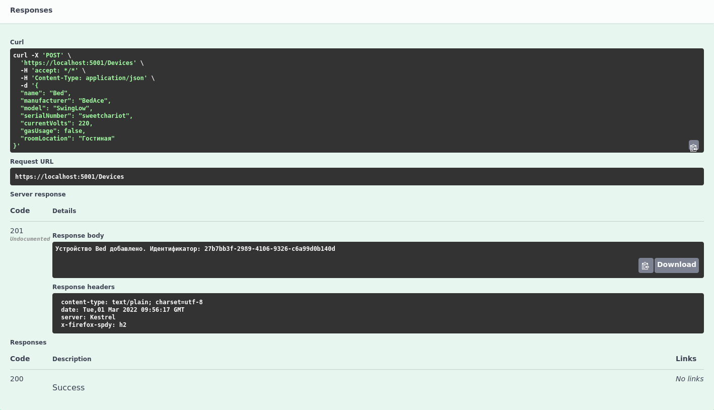
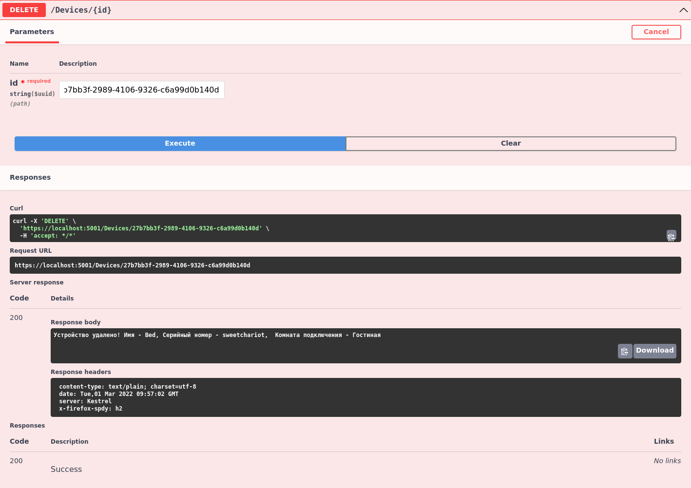
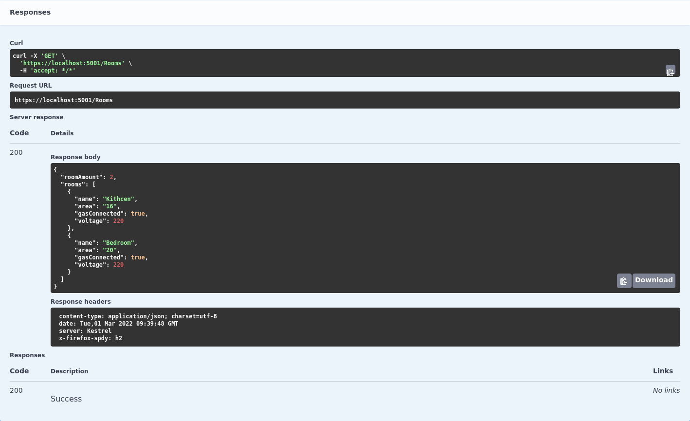
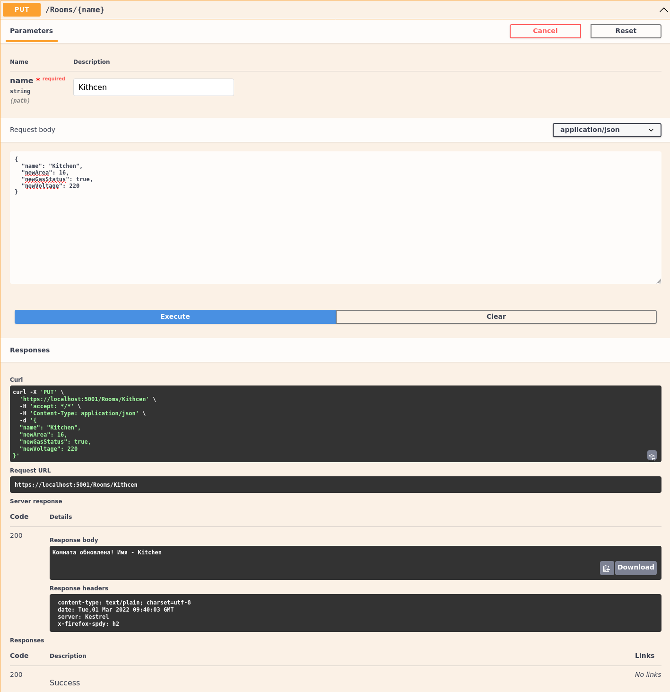

## Задание 34.8.1

Добавьте к нашему API метод для удаления устройства. Убедитесь, что он корректно работает как в _Postman_, так и в _Swagger_.

## Скриншоты

Решение прикрепите в виде ссылки на GitHub.

## Задание 34.8.2

В нашем API возникла необходимость полностью перенастраивать существующую комнату, перезаписывая все или часть её свойств. Какой HTTP-метод лучше всего для этого подойдет в соответствии с концепцией REST?

**PUT**

## Задание 34.8.3

Реализуйте метод из предыдущего задания (34.8.2) самостоятельно в нашем API!

## Скриншоты

