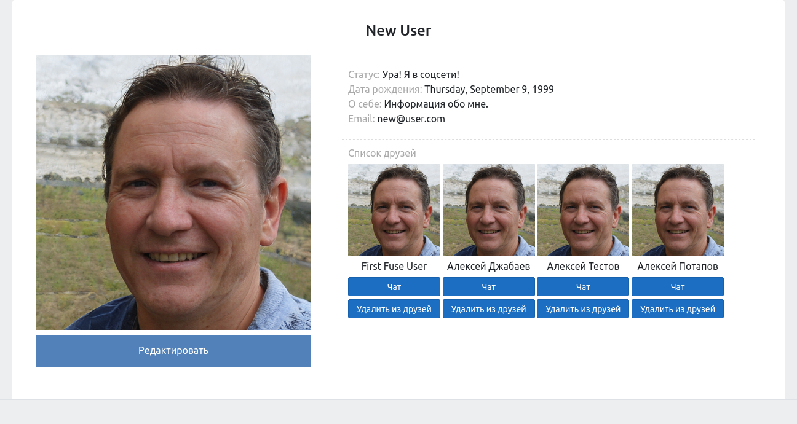
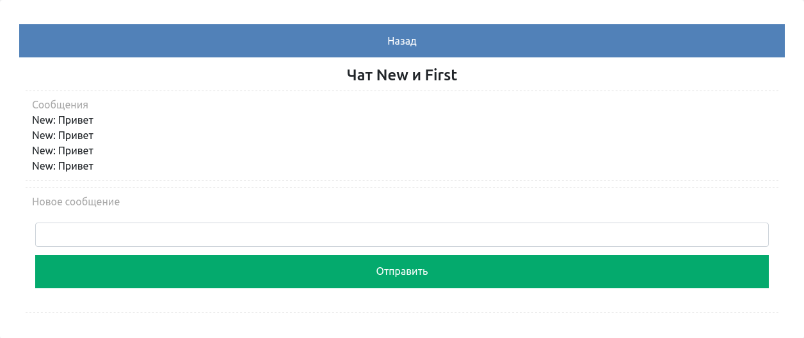
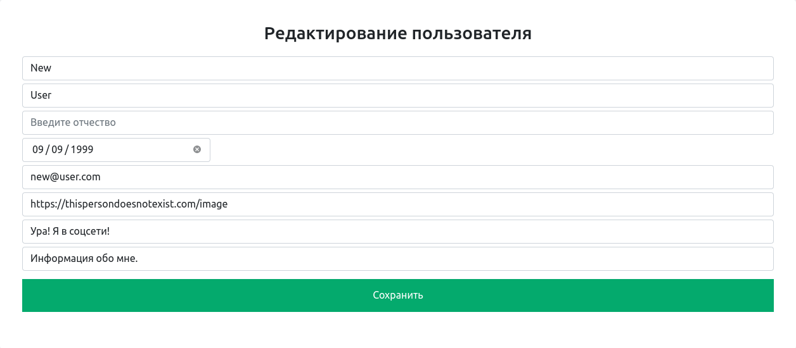
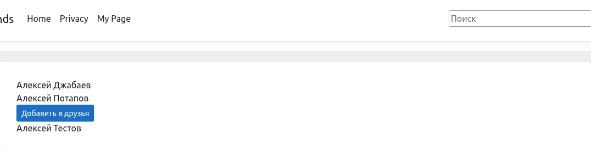
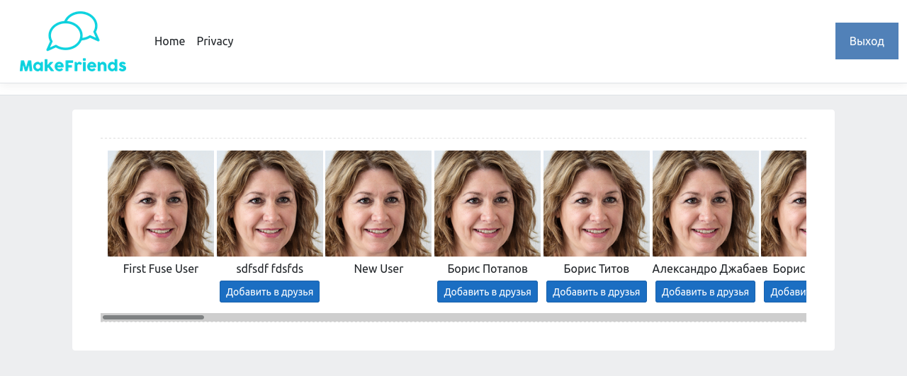
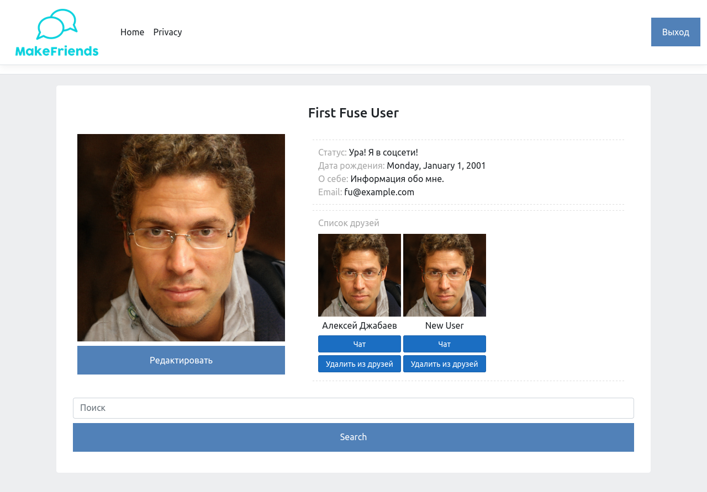

## Задание 32.11.1

Вам необходимо реализовать социальную сеть, в которой будет весь возможный функционал, который вы можете сделать на данный момент. Иными словами, вы сможете продемонстрировать все, чему вы уже научились.

В дальнейшем мы разберем большую часть функциональности, которая вам понадобится. Если же вы чувствуете в себе силы, вы можете не обращаться к этому модулю для подсказки, а реализовывать всё самостоятельно.

Список функций соцсети:

1. Регистрация
1. Авторизация
1. Страница пользователя с отображением фото, имени
1. Изменение данных пользователя
1. Поиск и добавление друзей
1. Отправка сообщений друзьям

## Скриншоты

